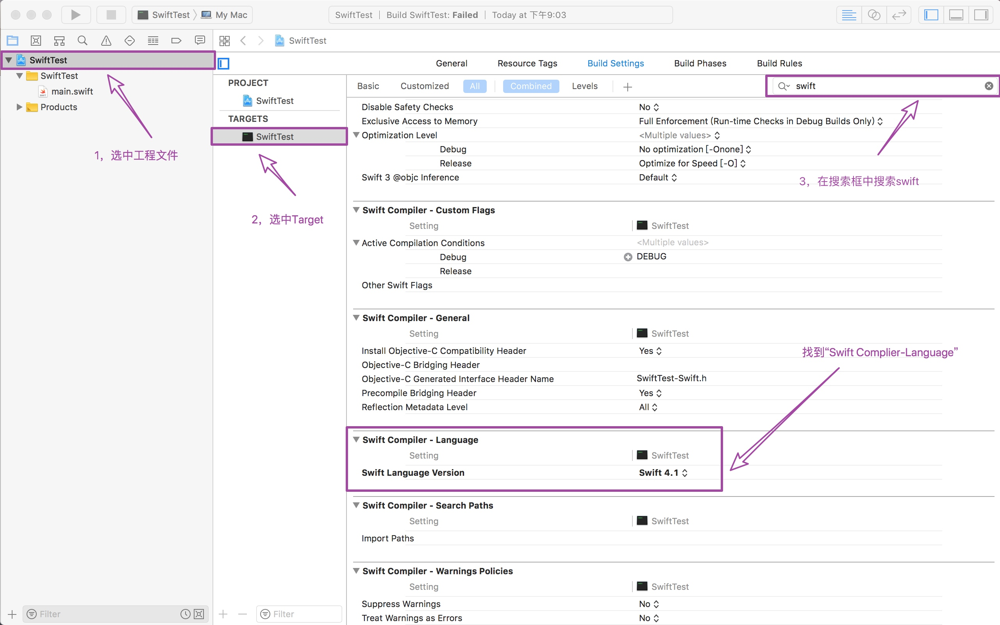
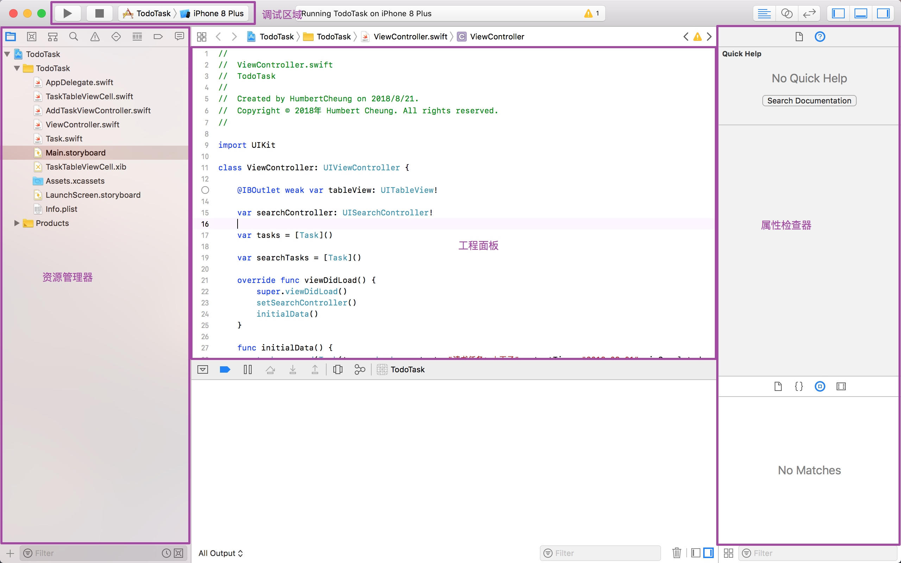

# Swift初见
## 关于Swift
> Swift是编写软件的绝佳方式，无论是用于手机，台式机，服务器还是其他任何运行代码的软件。它是一种安全，快速，交互式的编程语言，它将现代语言思维的最佳结合与来自更广泛的Apple工程文化的智慧和来自开源社区的各种贡献相结合。编译器针​​对性能进行了优化，并且语言针对开发进行了优化，而不会影响任何一种。

> Swift对新程序员很友好。它是一种工业级编程语言，与脚本语言一样富有表现力和乐趣。***在Playground上编写Swift代码可以让您试验代码并立即查看结果，而无需构建和运行应用程序的开销***。

Swift通过采用现代编程模式来定义大类常见的编程错误：

* 变量在使用前始终初始化。
* 检查数组索引是否存在越界错误。
* 检查整数是否溢出。
* Optionals确保nil明确处理值。
* 内存自动管理。
* 错误处理允许从意外故障中受控恢复。

> 编译和优化Swift代码以充分利用现代硬件。语法和标准库的设计基于指导原则，即编写代码的明显方法也应该表现最佳。它的安全性和速度相结合，使Swift成为从“Hello，world！”到整个操作系统的绝佳选择。

> Swift将强大的**类型推导**和**模式匹配**与现代轻量级语法相结合，允许以清晰简洁的方式表达复杂的想法。因此，代码不仅更容易编写，而且更易于阅读和维护。

> Swift多年来一直在不断发展，并且不断发展，具有新的特性和功能。

## Swift与Xcode版本适配
在开发当中，通常把用来编写软件的工具集叫做工具链。在工具链中用来写代码的部分叫做集成开发环境（IDE）。Swift最常用的IDE叫做Xcode，也就是大家即将要使用的。
iOS开发中，我们需要根据用户需要去适配各种各样的版本，当苹果爸爸每一次进行新版本发布时，作为奋斗在最前线的开发者，我们永远都需要是最先知道：

* Xcode适配
* Swift版本更新
* iPhone适配
* iOS系统适配

因为在我们的课程当中使用的是Swift4.0版本，所以主要讲解Swift与Xcode的适配问题，各版本适配情况如下：

> Swift 1.0-------Xcode 6/n
> Swift 1.1-------Xcode 6.1.1
> Swift 1.2-------Xcode 6.3
> Swift 2.0-------Xcode 7.0
> Swift 2.1-------Xcode 7.1
> Swift 2.1.1-----Xcode 7.2
> Swift 2.2-------Xcode 7.3
> Swift 2.2.1-----Xcode 7.3.1
> Swift 3.0-------Xcode 8
> Swift 3.0.1-----Xcode 8.1
> Swift 3.0.2-----Xcode 8.2
> Swift 3.1-------Xcode 8.3
> Swift 3.1.1-----Xcode 8.3.2
> Swift 4.0-------Xcode 9.0
> Swift 4.0.2-----Xcode 9.1
> Swift 4.0.3-----Xcode 9.2
> Swift 4.0.1-----Xcode 9.3
> Swift 4.1.1-----Xcode 9.3
> Swift 4.1.2-----Xcode 9.4

*那么如何查看当前的Swift版本？*

1. 在Swift项目中，选中项目文件
2. 在项目目标列表中选中Target，并点击Build Settings
3. 在右上方搜索栏中输入swift查找
4. 在搜索结果中找到“Swift Complier-Language”一栏，则可以看到当前项目使用的Swift版本了。

*另外，点击版本，还可以查看当前Xcode版本可兼容的其他版本的Swift，可以切换版本。*

## Xcode与Mac OS、iOS、Simulators版本适配

### 一、Mac OS

#### 认识Mac OS
macOS是一套运行于苹果Macintosh（麦金塔）系列电脑上的操作系统。macOS是首个在商用领域成功的图形用户界面操。苹果公司从2001年开始它是主操作系统对Apple的Mac系列电脑。在台式机，笔记本电脑和家用电脑以及网络应用市场中，它是仅次于Microsoft Windows的第二大应用最广泛的桌面操作系统。

Mac系统是基于Unix内核的图形化操作系统；一般情况下在普通PC上无法安装的操作系统。由苹果公司自行开发。同时，疯狂肆虐的电脑病毒几乎都是针对Windows的，由于MAC的架构与Windows不同，所以很少受到病毒的袭击。MAC OSX操作系统界面非常独特，突出了形象的图标和人机对话。苹果公司不仅自己开发系统，也涉及到硬件的开发。

macOS是Macintosh操作系统的第二个主要系列。第一个通俗地称为“经典”Mac OS于1984年推出，最终版本是1999年的Mac OS 9，第一个桌面版Mac OS X 10.0于2001年3月发布第一个更新即10.1，。在此之后，苹果公司开始在大型猫科动物之后命名它的发布，直到OS X 10.8 Mountain Lion。自OS X 10.9 Mavericks以来，发布版本以加利福尼亚州的地标命名。Apple在2012年将名称缩短为“OS X”，Mac OS X和OS X中的“X”是数字 10 的罗马数字，并且发音如此。然后在2016年将其更改为“macOS”，采用了他们用于其他操作系统如iOS，watchOS和tvOS的命名法。到目前为止最新版本是macOS High Sierra 10.13.6正式版。

Mac OS X 10.0——Cheetah（猎豹）
Mac OS X 10.1——Puma（美洲狮）
Mac OS X 10.2——Jaguar（美洲虎）
Mac OS X 10.3——Panther（黑豹）
Mac OS X 10.4——Tiger（虎）
Mac OS X 10.5——Leopard （美洲豹）
Mac OS X 10.6——Snow Leopard（雪豹）
Mac OS X 10.7—— Lion（狮）
OS X 10.8——Mountain Lion（山狮）
OS X 10.9 -- Mavericks（冲浪湾）
OS X 10.10--Yosemite（优胜美地）
OS X 10.11 El Capitan（酋长石）
macOS X 10.12 Sierra（山脊）
macOS X 10.13 High Sierra（高峰） 

具体使用参考《Mac os  操作手册》

### 四、认识Xcode
Xcode是一款功能全面的应用程序，通过此工具可以轻松输入、编译、调试并执行iOS程序。如果想在Mac上快速开发iOS应用程序，则必须学会使用这个强大的工具的方法。

（1）调试区域：左上角的这部分功能是控制程序编译调试或者终止调试，还有选择Scheme目标的地方。单击三角形图标会启动模拟器运行这个iOS程序，单击正方形图标会停止运行。

（2）资源管理器：左边这一部分是资源管理器，上方可以设置选择显示的视图，有Class视图、搜索视图、错误视图等。

（3）工程面板：这部分是最重要的，也是整个窗口中占用面积最大的区域。通常显示当前工程的总体信息，例如编译信息、版本信息和团队信息等。当在“资源管理器”中用鼠标选择一个源代码文件时，此时这个区域将变为“编码面板”，在面板中将显示这个文件的具体源代码。

（4）属性面板：在进行Storyboard或者xib设计时十分有用，可以设置每个控件的属性。和Visual C++、Vsiual Studio.NET中的属性面板类似。

1. 从左边开始我们来看看常用的工具栏项目，首先是run运行按钮，单击它可以打开模拟器来运行我们的项目。停止运行按钮是。另外，当单击并按住片刻后可以看到下面的弹出菜单，为我们提供了更多的运行选项。
 
2. 在停止运行按钮的旁边，可以看到图所示这样的一个下拉列表，这里让我们可以选择虚拟器的属性，是iPad还是iPhone。iOS Device是指真机测试，如所示。

3. 在导航区域包含了多个导航类型，例如选中第一个图标后会显示项目导航面板，即显示当前项目的构成文件，如图所示。

### 三、认识Playground

自从苹果公司发布Swift的时候，Xcode上又多了一样新的东西---"Playground"。Playground就像操场一样，可以供我们在代码的世界里尽情的玩耍。

#### 创建Playground

1. 打开Xcode，选择“get start with a playground”

2. 然后会跳转到下一页我们可以选择创建不同平台的playground，每个平台都有它们自己的环境设置，在窗口中我们可以选择不同平台中的模版来创建。

3. 当我们选中平台和模版之后点击Next选择保存路径后，点击create即可

> *Tips：如果我们找不到第一步当中的窗口，可能是“Show this window when Xcode launches”选项未勾选，或者是已经打开了其他的Xcode窗口了，那么，我们可以通过快捷键“shift+command+1”或者Window/Welcome to Xcode来重新打开欢迎窗口，如下图*
> 

> *当然，我们还可以通过快捷键“shift+option+command+N”来快速新建playground项目*

Playground是所见即所得的，就是你在左边写的代码，会立刻在右边看到该行代码运行的结果，可以让我们快速写然后测试代码，而不用构建一个完整的app。如下图所示，下面写了一个循环10次的for-in循环，右边就立刻出现了该循环对应的循环次数：10 times

#### playground预览
第一眼看上，playground很像一个高级记事本：

1. ***源编辑器***。这是你写Swift代码的地方。这很像一个文本编辑器比如Notepad或文本编辑（TextEdit）。你会看到叫做单间隔字体的使用，意味着所有字符都一样宽。这让代码读起来更轻松。
2. ***结果边栏***。这个区域显示你的代码运行的结果。看完全部教程后，你会学到更多代码是如何执行的。结果边栏会是查看来确定代码的确是预想地那么工作的主要区域。
3. ***执行控制***。Playgrounds默认自动执行代码，意味着你可以写代码，然后立即看到输出的结果。这个控制让你可以再次执行一遍playground代码。按住按钮可以在自动执行和手动执行模式之间切换。
4. ***活动查看器***。它显示了playground的状态。在截图里，它显示playground已经执行完，准备好在源编辑器里处理更多代码。playground在执行的时候，这个查看器会指示一个菊花。
5. ***版块控制***。这些开关决定显示和隐藏3个版块，一个显示在左边，一个在底部还有一个在右边。这些版块每个都显示一些你可能需要时时访问的额外信息。通常会让它们保持隐藏，就像它们在截图里那样。

Playground从上到下执行源编辑器里的代码。每次你改变代码，playground会重新执行所有代码。当然你也可以强行重新执行一遍，通过点击执行控制按钮。

在我们的窗口中，是有显示行号的，如果大家发现不显示，则可以打开源编辑器里左侧的行号，通过点击Xcode\Preferences...\Text Editing，勾选Line Numbers即可，如下图：

一旦playground执行完毕了，Xcode会更新结果边栏来在源编辑器里显示相应行的结果。

