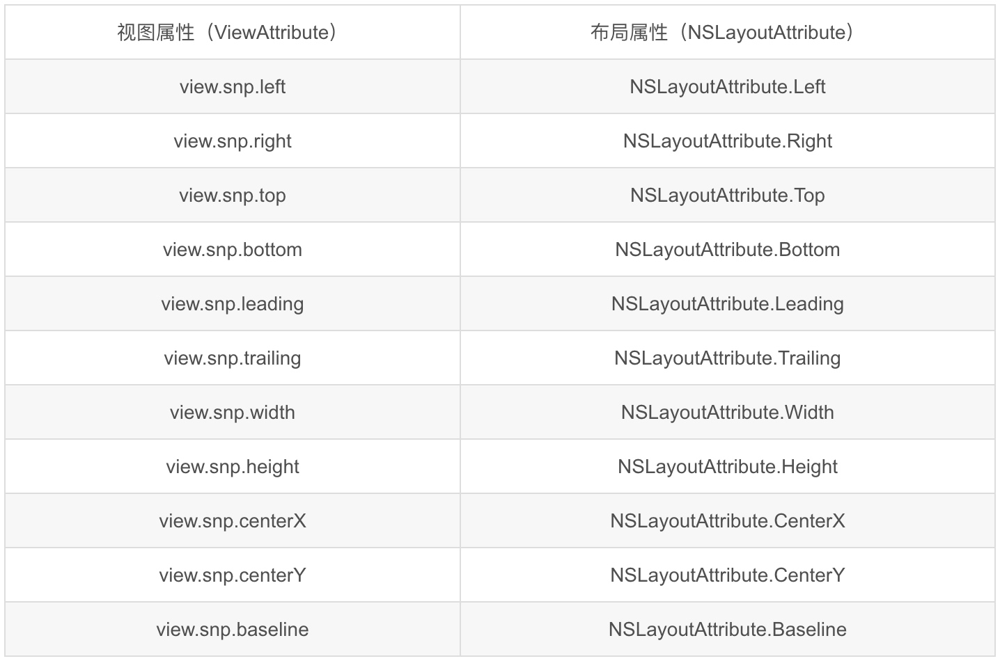

# UI基础（代码布局：SnapKit）

## 前言
在之前的课程当中，我们学习了可视化布局以及通过NSLayoutConstraint、VFL的代码布局方式，这节课我们主要学习第三方布局框架：**Snapkit**

## 概述
SnapKit是Github上一个开发大神[@Robert Payne](https://github.com/robertjpayne)写的Masonry（Objective-C比较流行的一个第三方布局工具）的Swift版本，其使用方式也与Masonry的使用方法极其类似，是专门为Swift语言提供AutoLayout布局使用的，特点为语法简洁易用。

## 配置SnapKit

1. 下载，在GitHub上搜索SnapKit或点击此处[Snapkit](https://github.com/SnapKit/SnapKit)地址；

2. 下再好后打开Snapkit的文件夹，将其中的Snapkit.xcodeproj文件拖入到我们的工程当中： 

3.  在我们的工程当中，点击工程 -> General -> Embedded Binaries 中点击加号，添加SnapKit库到项目中：

4. 然后需要对项目进行Build，可以通过快捷键`command + B` 

5. Build成功后，通过`import SnapKit`将SnapKit导入我们的页面中即可以使用

## 使用方法

通过 snp.makeConstraints 方法给view去添加约束，约束条件有几种，分别是：边距，宽，高，左上右下距离，基准线。同时，添加过约束后可以有修正，修正有位移修正（inset、offset）和倍率修正（multipliedBy）

语法一般是： **make.equalTo / make.greaterThanOrEqualTo / make.lessThanOrEqualTo + 倍数/位移修正**

其中，倍数通过方法`multipliedBy(ConstraintMultiplierTarget)`来设置；位移修正通过方法`offset(ConstraintOffsetTarget)`或inset`(ConstraintInsetTarget)`来设置

> **注意：**
> 使用 snp.makeConstraints 方法的元素必须事先添加到父元素的中，例如：self.view.addSubview(view)


```swift
import UIKit
import SnapKit

class ViewController: UIViewController {
    override func viewDidLoad() {
        super.viewDidLoad()
        
        // view1作为父视图
        let view1 = UIView()
        view1.frame = CGRect(x: 0, y: 0, width: 300, height: 300)
        view1.center = view.center
        view1.backgroundColor = UIColor(red: 143/255.0, green: 199/255.0, blue: 199/255.0, alpha: 1.0)
        view.addSubview(view1)
        
        // 测试视图
        let testView = UIView()
        testView.backgroundColor = UIColor.purple
        view1.addSubview(testView)
        testView.snp.makeConstraints { (make) in
            make.top.equalTo(view1).offset(50)      // 当前视图的顶部距离父视图的顶部：50（父视图顶部+50）
            make.left.equalTo(view1).offset(50)     // 当前视图的左边距离父视图的左边：50（父视图左边+50）
            make.bottom.equalToSuperview().inset(50)  // 当前视图的底部距离父视图的底部：-50（父视图底部-50）
            make.right.equalToSuperview().inset(50)   // 当前视图的右边距离父视图的右边：-50（父视图右边-50）
        }
    }
}
```
效果如下：


又如：


```swift
import UIKit
import SnapKit

class ViewController: UIViewController {
    override func viewDidLoad() {
        super.viewDidLoad()
        
        // view1作为父视图
        let view1 = UIView()
        view1.frame = CGRect(x: 0, y: 0, width: 300, height: 300)
        view1.center = view.center
        view1.backgroundColor = UIColor(red: 143/255.0, green: 199/255.0, blue: 199/255.0, alpha: 1.0)
        view.addSubview(view1)
        
        // 测试视图
        let testView = UIView()
        testView.backgroundColor = UIColor.purple
        view1.addSubview(testView)
        testView.snp.makeConstraints { (make) in
            //中心点与父视图重合
            make.center.equalToSuperview()
            //尺寸比父视图小1倍
            make.size.equalToSuperview().multipliedBy(0.5)
        }
    }
}
```
效果如下：


约束条件参数支持如下三种类型：

**（1）视图属性（ViewAttribute）**



除了以上的约束条件，还有其他的约束条件：**edges（边缘）**、**size(尺寸）**、**center(中心）**，以上案例还有更简洁的语法，如下：

```swift
import UIKit
import SnapKit

class ViewController: UIViewController {
    override func viewDidLoad() {
        super.viewDidLoad()
        
        // view1作为父视图
        let view1 = UIView()
        view1.frame = CGRect(x: 0, y: 0, width: 300, height: 300)
        view1.center = view.center
        view1.backgroundColor = UIColor(red: 143/255.0, green: 199/255.0, blue: 199/255.0, alpha: 1.0)
        view.addSubview(view1)

        // 测试视图
        let testView = UIView()
        testView.backgroundColor = UIColor.purple
        view1.addSubview(testView)
        testView.snp.makeConstraints { (make) in
            make.edges.equalToSuperview().inset(UIEdgeInsets(top: 50, left: 50, bottom: 50, right: 50))
        }
    }
}
```

又如size：

```swift
import UIKit
import SnapKit

class ViewController: UIViewController {
    override func viewDidLoad() {
        super.viewDidLoad()
        
        // view1作为父视图
        let view1 = UIView()
        view1.frame = CGRect(x: 0, y: 0, width: 300, height: 300)
        view1.center = view.center
        view1.backgroundColor = UIColor(red: 143/255.0, green: 199/255.0, blue: 199/255.0, alpha: 1.0)
        view.addSubview(view1)
        
        // 测试视图
        let testView = UIView()
        testView.backgroundColor = UIColor.purple
        view1.addSubview(testView)
        testView.snp.makeConstraints { (make) in
            make.size.equalTo(CGSize(width: 200, height: 200))
        }
    }
}
```
效果图如下：


再如center：

```swift
import UIKit
import SnapKit

class ViewController: UIViewController {
    override func viewDidLoad() {
        super.viewDidLoad()
        
        // view1作为父视图
        let view1 = UIView()
        view1.frame = CGRect(x: 0, y: 0, width: 300, height: 300)
        view1.center = view.center
        view1.backgroundColor = UIColor(red: 143/255.0, green: 199/255.0, blue: 199/255.0, alpha: 1.0)
        view.addSubview(view1)
        
        // 测试视图
        let testView = UIView()
        testView.backgroundColor = UIColor.purple
        view1.addSubview(testView)
        testView.snp.makeConstraints { (make) in
            make.size.equalTo(CGSize(width: 200, height: 200))
            make.center.equalTo(CGPoint(x: 50, y: 50))
        }
    }
}
```
效果图如下：


> **Tips：**
> 约束条件也是有优先级的，可以在约束的末尾添加上优先级，可以通过以下方法来设置优先级：

> * priority()：允许指定一个确切的优先级
> * priorityHigh()：最高优先级 (已弃用)
> * priorityLow()：最低优先级 (已弃用)
> * priorityMedium()：一般优先级 (已弃用)
> * priorityRequired()：同High (已弃用)
> 
> 如下：
> 
> ```swift
> make.left.lessThanOrEqualTo(view.snp_left).priorityLow()
> make.top.equalTo(view).offset(44.0).priority(600)
> ```

**（2）视图关系（UIView/NSView）** 

* equalTo：等于 
* lessThanOrEqualTo：小于等于
* greaterThanOrEqualTo：大于等于

比如：

```swift
//让left 大于等于 label.left,两种写法都可以
make.left.greaterThanOrEqualTo(label)
make.left.greaterThanOrEqualTo(label.snp.left)
```

**案例练习：**

登录页面（如下效果图）


```swift
import UIKit
import SnapKit

let SCREEN_HEIGHT = UIScreen.main.bounds.size.height
let SCREEN_WIDTH = UIScreen.main.bounds.size.width

class ViewController: UIViewController {
    
    var logo = UIImageView()
    var titleLbl = UILabel()
    var accountText = UITextField()
    var passwordText = UITextField()
    var loginBtn = UIButton()

    override func viewDidLoad() {
        super.viewDidLoad()

        view.addSubview(loginBtn)
        
        setViews()
    }
    
    func setViews() {
        view.backgroundColor = UIColor(red: 143/255.0, green: 199/255.0, blue: 199/255.0, alpha: 1.0)
        logo.image =  UIImage(named: "logo")
        logo.sizeToFit()
        view.addSubview(logo)
        
        titleLbl.text = "我的日记"
        titleLbl.textColor = UIColor.white
        view.addSubview(titleLbl)
        
        accountText.layer.cornerRadius = 5
        accountText.placeholder = "请输入用户名"
        accountText.backgroundColor = UIColor.white
        view.addSubview(accountText)
        
        passwordText.layer.cornerRadius = 5
        passwordText.placeholder = "请输入密码"
        passwordText.isSecureTextEntry = true
        passwordText.backgroundColor = UIColor.white
        view.addSubview(passwordText)
        
        loginBtn.setTitle("登录", for: .normal)
        loginBtn.backgroundColor = UIColor(red: 217/255.0, green: 88/255.0, blue: 117/255.0, alpha: 1.0)
        loginBtn.layer.cornerRadius = 10
        
        logo.snp.makeConstraints{ (maker) in
            maker.centerX.equalToSuperview()
            maker.top.equalTo(SCREEN_HEIGHT * 0.1)
        }
        
        titleLbl.snp.makeConstraints { (maker) in
            maker.centerX.equalToSuperview()
            maker.top.equalTo((logo.snp.bottom)).offset(20)
        }
        
        accountText.snp.makeConstraints { (maker) in
            maker.centerX.equalToSuperview()
            maker.top.equalTo(titleLbl.snp.bottom).offset(30)
            maker.width.equalTo(SCREEN_WIDTH * 0.7)
            maker.height.equalTo(30)
        }
        
        passwordText.snp.makeConstraints { (maker) in
            maker.centerX.equalToSuperview()
            maker.top.equalTo(accountText.snp.bottom).offset(20)
            maker.height.equalTo(accountText)
            maker.width.equalTo(accountText)
        }
        
        loginBtn.snp.makeConstraints { (maker) in
            maker.centerX.equalToSuperview()
            maker.top.equalTo(passwordText.snp.bottom).offset(50)
            maker.width.equalTo(passwordText)
            maker.height.equalTo(40)
        }
    }
}
```

#### 案例迭代

使用SnapKit实现上节课的需求，效果图如下：


**参考代码：**

```swift
import UIKit
import SnapKit

class ViewController: UIViewController {

    override func viewDidLoad() {
        super.viewDidLoad()
        setViews()
    }
    
    func setViews() {
        var myView: UIView
        myView = UIView()
        myView.backgroundColor = UIColor(red: 194/255.0, green: 183/255.0, blue: 223/255.0, alpha: 1.0)
        //关闭控件的autoresing
        myView.translatesAutoresizingMaskIntoConstraints = false
        self.view.addSubview(myView)
        
        var anotherView: UIView
        anotherView = UIView()
        anotherView.backgroundColor = UIColor(red: 91/255.0, green: 166/255.0, blue: 117/255.0, alpha: 1.0)
        anotherView.translatesAutoresizingMaskIntoConstraints = false
        self.view.addSubview(anotherView)
        
        var thirdView: UIView
        thirdView = UIView()
        thirdView.backgroundColor = UIColor(red: 68/255.0, green: 184/255.0, blue: 168/255/0, alpha: 1.0)
        thirdView.translatesAutoresizingMaskIntoConstraints = false
        self.view.addSubview(thirdView)
        
        myView.snp.makeConstraints { (maker) in
            maker.top.equalTo(200)
            maker.leading.equalTo(50)
            maker.height.equalTo(100)
            maker.width.equalTo(anotherView)
        }
        
        anotherView.snp.makeConstraints { (maker) in
            maker.top.equalTo(myView)
            maker.leading.equalTo(myView.snp.trailing).offset(50)
            maker.height.equalTo(myView)
            maker.width.equalTo(myView)
            maker.trailing.equalTo(-50)
        }
        
        thirdView.snp.makeConstraints { (maker) in
            maker.top.equalTo(myView.snp.bottom).offset(50)
            maker.leading.equalTo(50)
            maker.trailing.bottom.equalTo(-50)
        }
    }
}
```

**拓展需求：**

在以上案例的基础上，将thridView切分为3个view，分割后的每个view宽高相等，每个view的间距为30，效果图如下：


**参考代码：**

```swift
import UIKit
import SnapKit

class ViewController: UIViewController {

    override func viewDidLoad() {
        super.viewDidLoad()
        setViews()
    }
    
    func setViews() {
        var myView: UIView
        myView = UIView()
        myView.backgroundColor = UIColor(red: 194/255.0, green: 183/255.0, blue: 223/255.0, alpha: 1.0)
        //关闭控件的autoresing
        myView.translatesAutoresizingMaskIntoConstraints = false
        self.view.addSubview(myView)
        
        var anotherView: UIView
        anotherView = UIView()
        anotherView.backgroundColor = UIColor(red: 91/255.0, green: 166/255.0, blue: 117/255.0, alpha: 1.0)
        anotherView.translatesAutoresizingMaskIntoConstraints = false
        self.view.addSubview(anotherView)
        
        var thirdView: UIView
        thirdView = UIView()
        thirdView.backgroundColor = UIColor(red: 68/255.0, green: 184/255.0, blue: 168/255/0, alpha: 1.0)
        thirdView.translatesAutoresizingMaskIntoConstraints = false
        self.view.addSubview(thirdView)
        
        var fourthView: UIView
        fourthView = UIView()
        fourthView.backgroundColor = UIColor(red: 68/255.0, green: 184/255.0, blue: 168/255/0, alpha: 1.0)
        fourthView.translatesAutoresizingMaskIntoConstraints = false
        self.view.addSubview(fourthView)
        
        var fifthView: UIView
        fifthView = UIView()
        fifthView.backgroundColor = UIColor(red: 68/255.0, green: 184/255.0, blue: 168/255/0, alpha: 1.0)
        fifthView.translatesAutoresizingMaskIntoConstraints = false
        self.view.addSubview(fifthView)
        
        myView.snp.makeConstraints { (maker) in
            maker.top.equalTo(200)
            maker.leading.equalTo(50)
            maker.height.equalTo(100)
            maker.width.equalTo(anotherView)
        }
        
        anotherView.snp.makeConstraints { (maker) in
            maker.top.equalTo(myView)
            maker.leading.equalTo(myView.snp.trailing).offset(50)
            maker.height.equalTo(myView)
            maker.width.equalTo(myView)
            maker.trailing.equalTo(-50)
        }
        
        thirdView.snp.makeConstraints { (maker) in
            maker.top.equalTo(myView.snp.bottom).offset(50)
            maker.leading.equalTo(50)
            maker.trailing.equalTo(-50)
            maker.height.equalTo(fourthView)
        }
        
        fourthView.snp.makeConstraints { (maker) in
            maker.top.equalTo(thirdView.snp.bottom).offset(30)
            maker.leading.equalTo(thirdView)
            maker.trailing.equalTo(thirdView)
            maker.height.equalTo(fifthView)
        }
        
        fifthView.snp.makeConstraints { (maker) in
            maker.top.equalTo(fourthView.snp.bottom).offset(30)
            maker.leading.equalTo(fourthView)
            maker.trailing.equalTo(fourthView)
            maker.bottom.equalToSuperview().offset(-50)
        }
    }
}
```

## AutoLayout总结

1、在一些层级比较简单、固定的界面以及界面元素单一简单的界面使用xib、StoryBoard可视化布局。比如登录、注册或者其他只是进行内容展示的界面，使用XIB、StoryBoard开发起来会更简单快一些，这个时候我们也应该使用XIB、StoryBoard开发。
 
2、在一些复杂、控件较多和功能多的界面尽量使用代码进行布局开发。因为控件多功能复杂的界面如果使用XIB、StoryBoard，那么通过拉线的形式添加约束布局，一个XIB里拉满了密密麻麻的约束线，可以肯定的是过不了多久连自己都看晕了。如果这个模块要交给第二个人维护，那么这些密密麻麻的约束线肯定是一个让人头疼的问题。因为XIB中约束过多的话，首先可读性是非常差的，带来的后续问题是开发思路不清晰、维护难。

3、需要复用的模块尽量使用代码布局。如果使用XIB、StoryBoard则无法很好的对代码模块进行复用。

